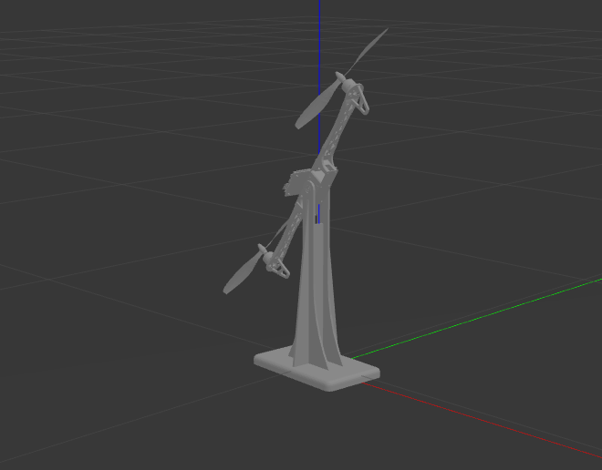
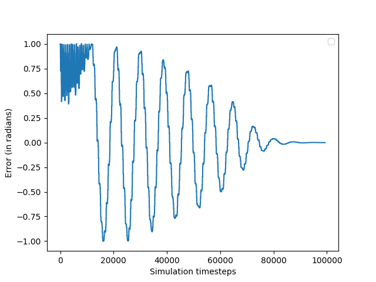
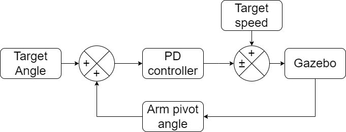

# Self-balancing bot simulation

This is a self-balancing bot simulation using Gazebo and ros for control. The bot is controlled using a PD controller with arm joint angle as feedback.

This simulation uses ROS melodic and matplotlib

Please find instructions for installing ROS. [Here](http://wiki.ros.org/melodic)

After installing ROS. you can copy the balancing bot file into your src folder in your ros workspace and build it.

then run these commands for running gazebo and control ros node.

```
roslaunch balancing_bot gazebo.launch 
```
You should be able see the balancing like in the below image



In another terminal run

```
rosrun balancing_bot example_pd_controller.py 
```

After running the last command, you should be able to the balancing the arm link.

<video src="example_pd.mp4" controls="controls" style="max-width: 730px;">
</video>

with the error decreasing over time like this,


The PD controller block diagram here explains the control loop




