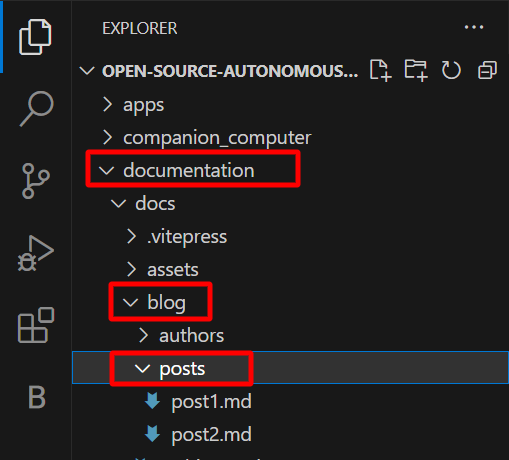
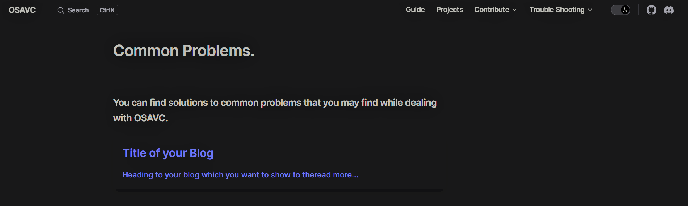

# Adding Blog to the Trouble Shooting section

- Navigate inside the OSAVC git repo which we have cloned

- documentation -> docs -> blog -> posts

```
.
├─ docs              <---
│  ├─ .vitepress
│  │  └─ config.js
│  ├─ about
│  ├─ assets
│  ├─ blog           <---
│  |  └─ posts       <---
│  └─ contribute
│  └─ guide
│  └─ index.md
└─ package.json
```

Inside the folder create your Markdown file in format **name.md**.

example : **post1.md**

if you are using a IDE like VsCode you can see the file structure as shown below.



here we have created two blog posts named **post1.md** and **post2.md**

Inside the **post1.md** you can write the trouble shooting section in using Markdown language.

```md
---
date: year-month-day
title: 'Title of your blog'
category: Tutorial            <!-- Category of your blog -->
tags:                         <!-- Define Tags so that they can be easily categorized
 -->
 - Harware
 - Software
---

> Heading to your blog which you want to show to the user on the trouble shooting section

---

## Here you can start writing your blog

Use markdown language to create points, adding images etc.
```

Now we have successfully completed creating the md file for our blog.

Now for listing it on our website we need to add the data of our blog to the **data.json** file which you can find inside the blog folder.


The **data.json** file will contain information like

```json
[
  {
    "title": "Title of your Blog",
    "path": "./posts/post1",  // relative path to your blog
    "excerpt": "Heading to your blog which you want to show to the user on the trouble shooting section"
  },
]
```

You have to add different section for your blog in the above given format.

This will add your blog as a ArticleCard on the Trouble Shooting section.

You can always view the blogs on the website by hosting it locally by running the `docs:dev` script which will start a local dev server with instant hot updates.

Run the following command on your terminal.

::: code-group

```sh [npm]
npm run docs:dev
```

```sh [pnpm]
pnpm run docs:dev
```

```sh [yarn]
yarn docs:dev
```

:::

The dev server should be running at `http://localhost:5173`. Visit the URL in your browser to see your changes in action!

The Trouble shooting section should now contain your blog as shown below.


