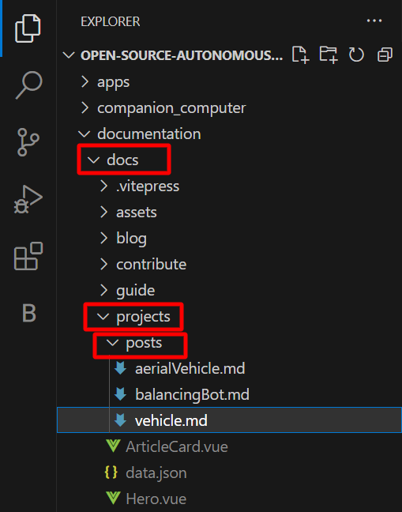
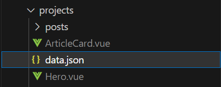
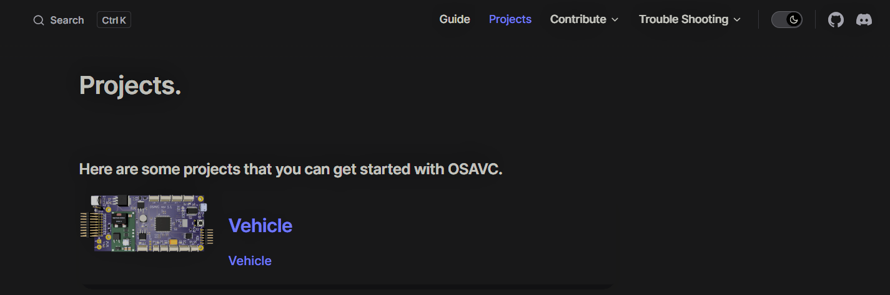

# Adding a Project on the website.

- Navigate inside the OSAVC git repo which we have cloned

- documentation -> docs -> projects -> posts

```
.
├─ docs              <---
│  ├─ .vitepress
│  │  └─ config.js
│  ├─ about
│  ├─ assets
│  ├─ blog
│  └─ contribute
│  └─ guide
│  └─ projects       <---
│  |  └─ posts       <---
│  └─ index.md
└─ package.json
```

Inside the folder create your Markdown file in format **name.md**.

example : **Vehicle.md**

if you are using a IDE like VsCode you can see the file structure as shown below.



Inside the **vehicle.md** you can write the details of your project using Markdown language.

```md

# Name of your Project

> Short description of your project.

## Detailed Explanation of the project
```

Now we have successfully completed creating the md file for our Project.

Now for listing it on our website we need to add the data of our project to the **data.json** file which you can find inside the projects folder.



The **data.json** file will contain information like

```json
[
  {
    "author": "Author Name",
    "image": "Link of the image you want to add on the ArticleCard", // this image has to be hosted online in png format
    // eg: https://i.ibb.co/3Tjw3gv/OSAVC-BOARD.png
    // This Link has the OSAVC Image hosted online
    "title": "Title of your Project",
    "path": "./posts/post1",  // relative path to your md file
    "excerpt": "Short description to your project which you want to show to the user on the home page of Projects"
  },
]
```

You have to add different section for your project in the above given format.

This will add your Project as a ArticleCard on the Projects home page.

You can always view the project on the website by hosting it locally by running the `docs:dev` script which will start a local dev server with instant hot updates.

Run the following command on your terminal.

::: code-group

```sh [npm]
npm run docs:dev
```

```sh [pnpm]
pnpm run docs:dev
```

```sh [yarn]
yarn docs:dev
```

:::

The dev server should be running at `http://localhost:5173`. Visit the URL in your browser to see your changes in action!

The Projects section should now contain your project as shown below.


