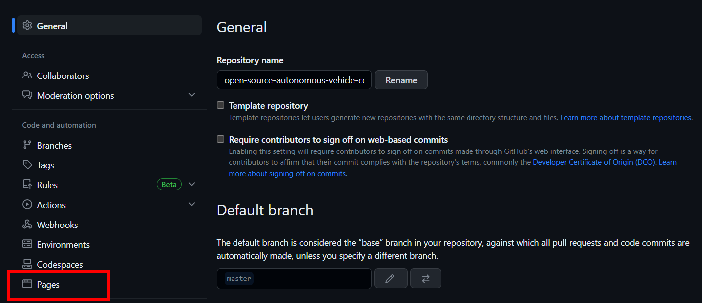
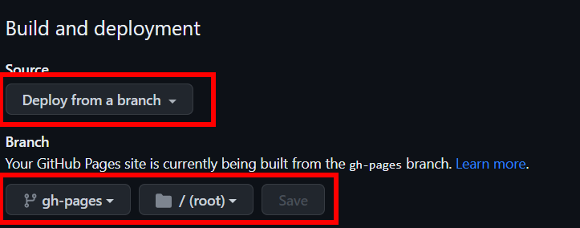

# Deploy Your Website on Github Pages

The following guides are based on some shared assumptions:

- The Website is inside the `documentation/docs` directory of your project.
- You are using the default build output directory (`.vitepress/dist`).
- VitePress is installed as a local dependency in your project, and you have set up the following scripts in your `package.json`:

  ```json
  {
    "scripts": {
    "docs:dev": "OSAVC dev docs",
    "docs:build": "OSAVC build docs",
    "docs:preview": "OSAVC preview docs"
    }
  }
  ```

::: warning
All of the above files are present when you clone the repository, do not change them.
:::

## Build and Test Locally

1. Run this command to build the docs:

   ```sh
   npm run docs:build
   ```

2. Once built, preview it locally by running:

   ```sh
   npm run docs:preview
   ```

   The `preview` command will boot up a local static web server that will serve the output directory `.vitepress/dist` at `http://localhost:4173`. You can use this to make sure everything looks good before pushing to production.

3. You can configure the port of the server by passing `--port` as an argument.

   ```json
   {
     "scripts": {
       "docs:preview": "OSAVC preview docs --port 8080"
     }
   }
   ```

Now the `docs:preview` method will launch the server at `http://localhost:8080`.

## Setting a Public Base Path

By default, our site is going to be deployed at the root path of a domain (`/`).

**Example:** We're using Github Pages and deploying to `user.github.io/open-source-autonomous-vehicle-controller/`, thus we set our `base` to `/open-source-autonomous-vehicle-controller/`.

```ts
base: '/open-source-autonomous-vehicle-controller/',
```

## Platform Guide

### GitHub Pages

1. In your theme config file, `documentation/docs/.vitepress/config.ts`, set the `base` property to the name of your GitHub repository.
eg : **base: '/open-source-autonomous-vehicle-controller/',**

2. Make sure you have build the project using:

    ```bash
    npm run dev:build
    ```

3. Now navigate to the base of the repository and commit your code and push it to your forked repo.

4. Now for deploying your website follow the steps given below.

- use the following command to add dist folder to the staging area

```bash
git add documentation/docs/.vitepress/dist -f
```

- -f is required, as your .gitignore will not consider your /dist folder. Hence it requires for git to consider it as well.

- Now run the following command in your terminal

```bash
git commit -m "Adding dist"
```

```bash
git subtree push --prefix /documentation/docs/.vitepress/dist origin gh-pages
```

- This will push your dist folder to the gh-pages branch

- Now navigate to Settings -> Pages




- Set Build and deployment as
    1. Source -> Deploy from a branch
    2. Branch -> gh-pages



- Click on Save

- You can see the Link to your website:


For Creating a Pull request follow the instructions [here](../website/pullRequest.md)
