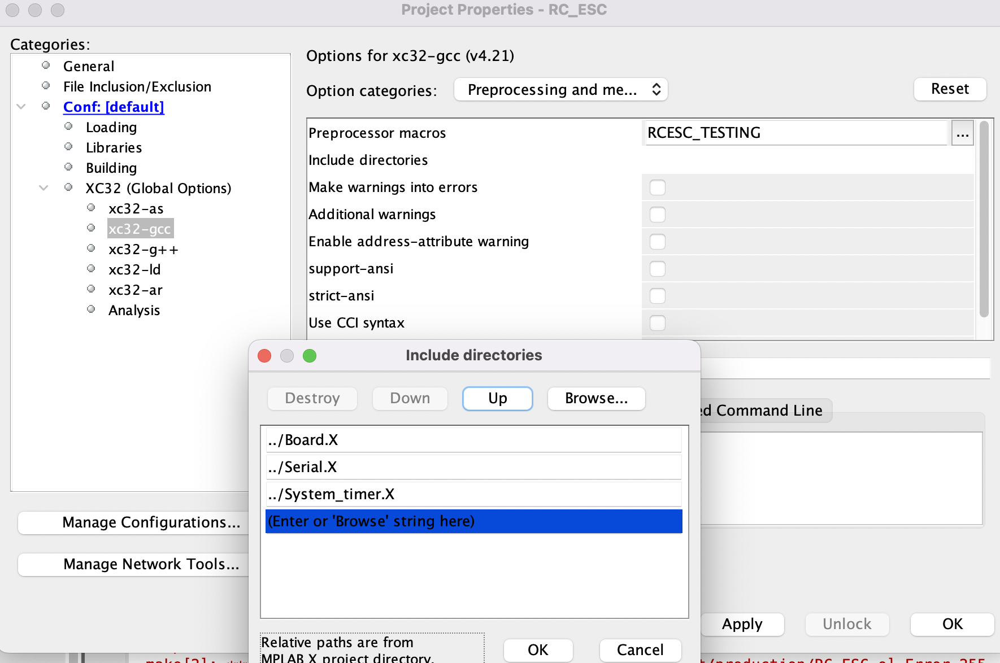
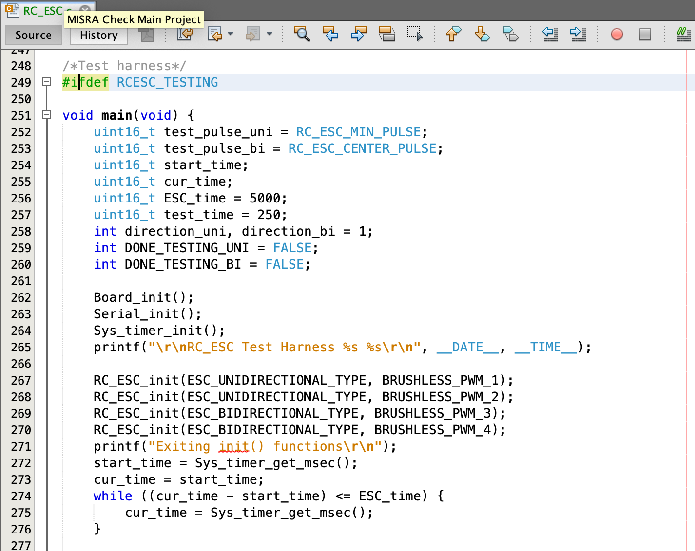
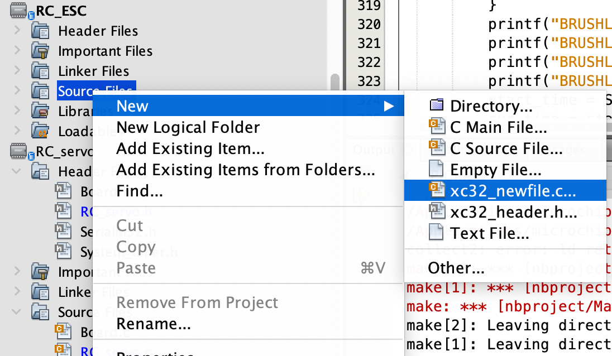

# Creating RC_ESC.X

- File -> New Project to create a new MIcrochip Embedded Standalone Project

- Click Next and make sure to select PIC32MX795F512L as the Device and the PICkit3 as the Tool

- Click Next and select XC32 v4.21 as the compiler

- Click Next and set the Project Name to what you want to name the library and the Project Location as open-source-autonomous-vehicle-controller/lib

- Click Finish and create new xc32_header.h files under the Header Files folder by right clicking the folder -> clicking New -> xc32_header.h

- Create new xc32_newfile.c files under the Source Files folder by right clicking the folder -> clicking New -> xc32_newfile.

- It is good practice to include a test harness for your device defined within an #ifdef directive in your new .c file.

- Navigate to File -> Project Properties -> XC32 (Global Options) -> xc32-gcc. Choose Preprocessing and messages as the option categories.
- Click the three dots next to Preprocessor macros and enter the macro that your #ifdef directive checks in your test harness. In this case, the macro will be RCESC_TESTING

- Click OK to save
- Click the three dots next to Include directories to enter the relative paths of all the libraries that you will use in your new project. In this case, Board.X, Serial.X, and System_timer.X

- Click OK to save.
- Add the header files from the libraries that you will be using by right clicking on Header Files -> Add Existing Item -> select the .h file to add. In this case, Board.h, SerialM32.h, System_timer.h

- Under Source Files, repeat the same process for the .c files that correspond to the .h files you’ve included. In this case, Board.c, SerialM32.c, System_timer.c
