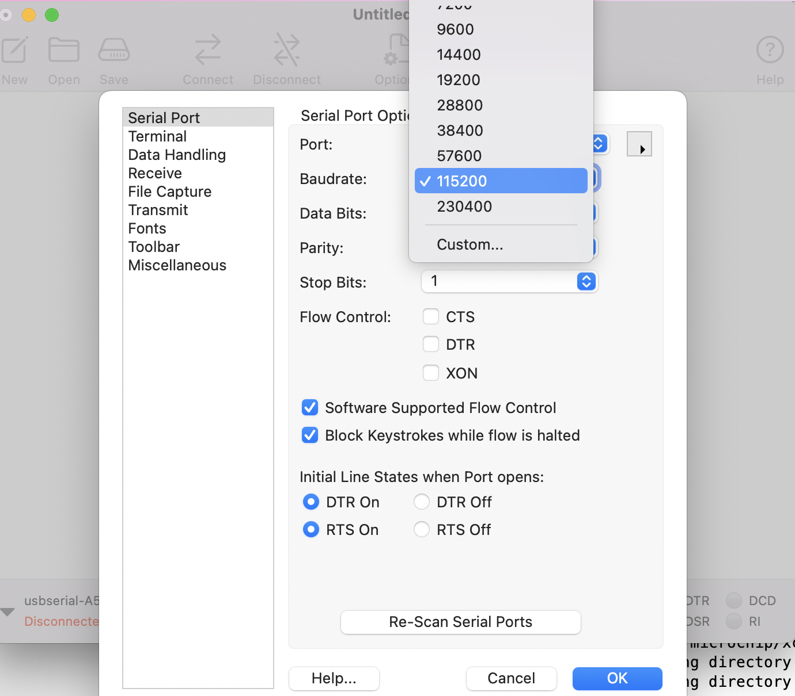
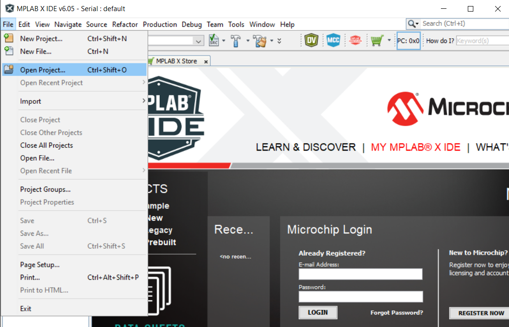
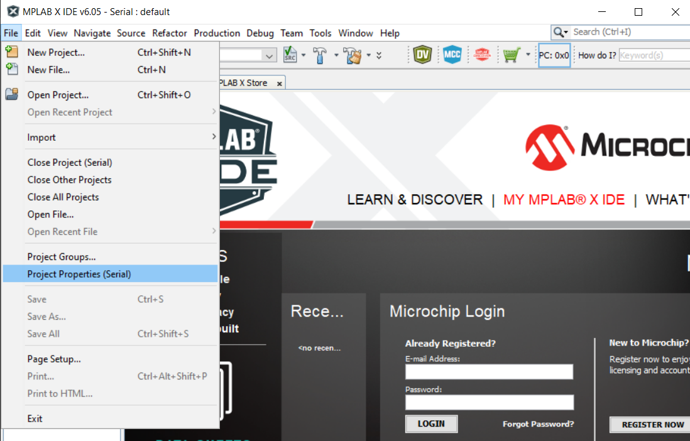
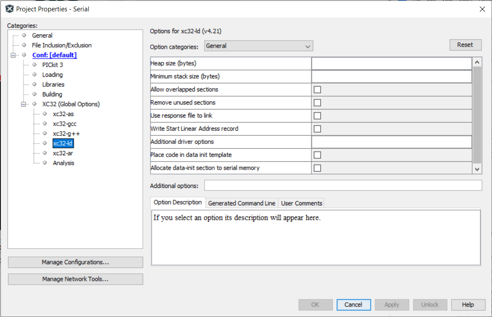
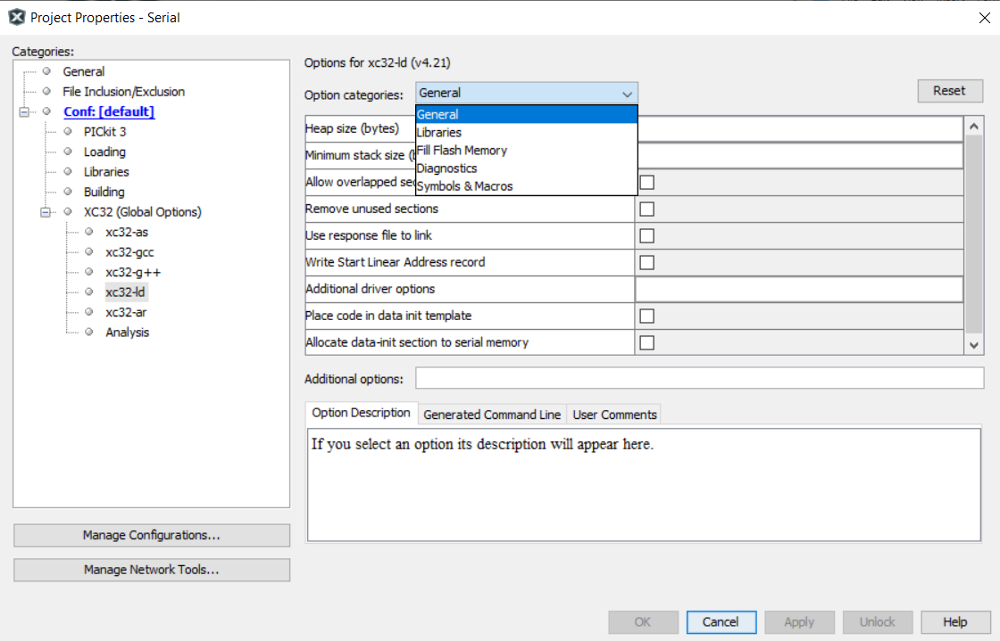
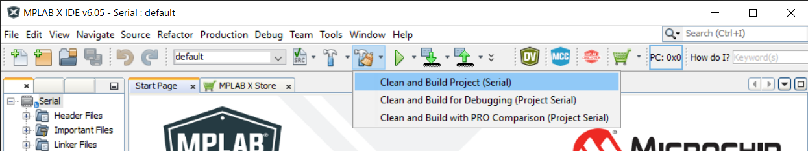
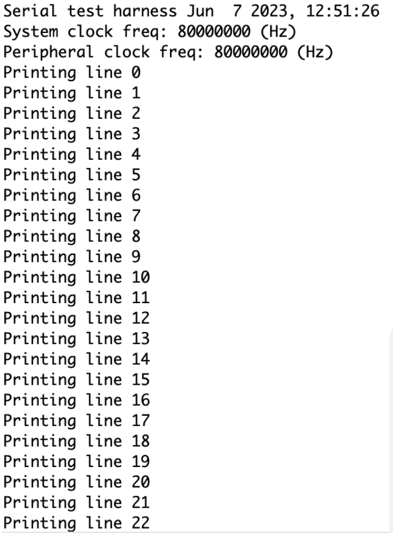
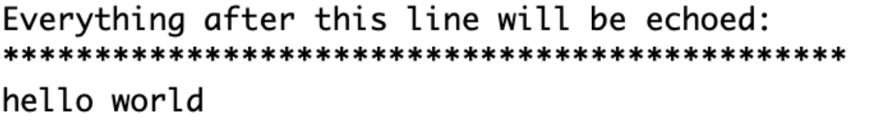

# Building Your First Project

## Cloning the Repository

To clone the Repo just execute the following command on Gitbash or your terminal prompt.
We are making the project folder in Desktop you can clone it into directory you want.
Navigate to your desired directory

```bash
cd Desktop
```

```bash
git clone https://github.com/uccross/open-source-autonomous-vehicle-controller.git
```

Now navigate to the modules directory in the Cloned Repo

```bash
cd open-source-autonomous-vehicle-controller/modules
```

Clone the submodules in this directory

```bash
git clone https://github.com/mavlink/c_library_v2
```

## Setting up Hardware


- Connect ICSP (in circuit serial programming) of PICKIT 3 to the OSAVC
  - Use a mini USB-b cable to connect the PICKIT 3 to your computer
- Use a micro USB cable to connect the OSAVC to your computer for power and a communications port

## Setting up Serial Terminal (CoolTerm / mobaxterm / putty)

- Open CoolTerm after connecting your PC to the OSAVC
- Choose the port at the bottom left of the application as usbserial


- Click Options -> Select 115200 as the baud rate -> Click OK to save


- Click Connect at the top of the application

## Setting up the MPLAB X

### Follow the below given setps for running Serial.X

- File -> Open Project


- Now navigate to -> open-source-autonomous-vehicle-controller -> lib -> Serial.X
you would be able to see the below window with the serial project open


- Now Open Serial.X Project Properties (File -> Project Properties)


- Choose Connected Hardware Tool to PICkit3

- Navigate to xc32-ld


- Choose General as the option category


- set the Heap Size (bytes) to be 8000 bytes


- Click OK to save the modified Project Properties


- Click Clean and Build


- Click Make and Program Device


- Open your preset serial terminal application (CoolTerm)

Output should be:


- Try typing something and press Enter


- What you type should now stay in the serial terminal
