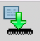
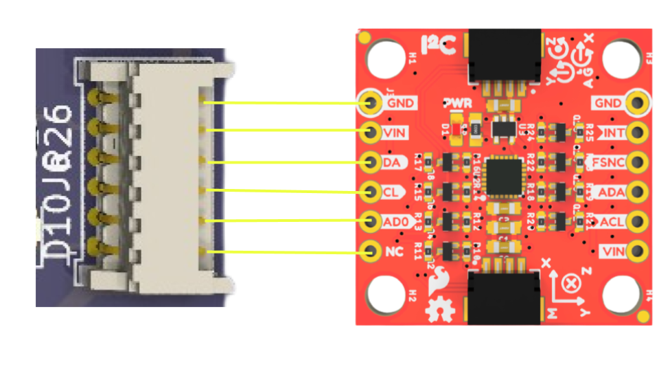
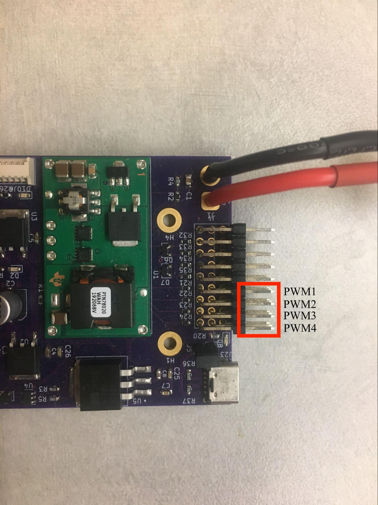
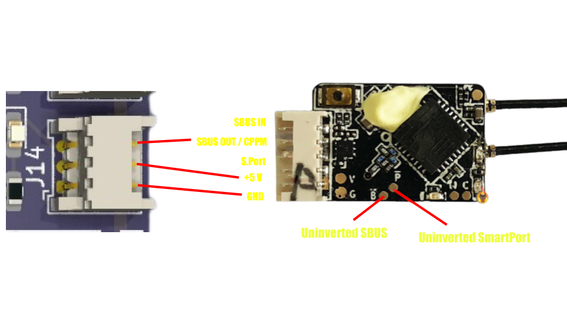
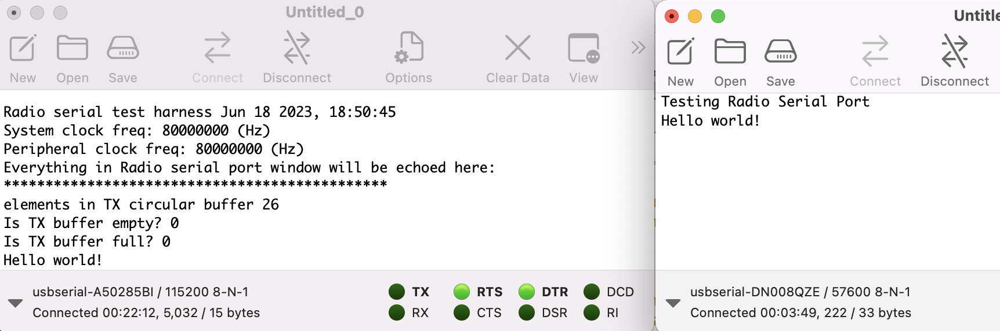
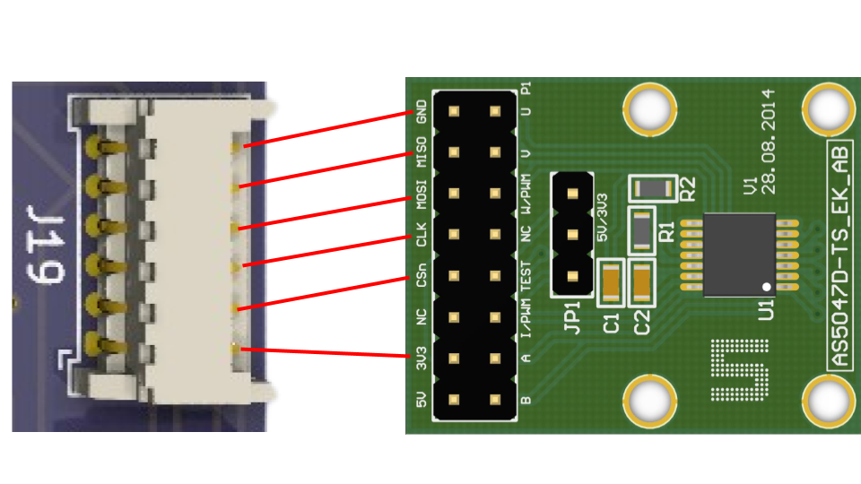
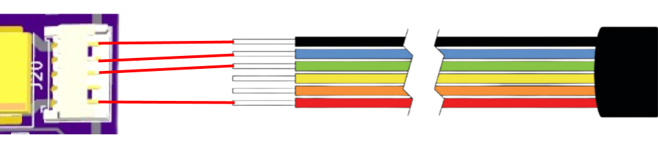
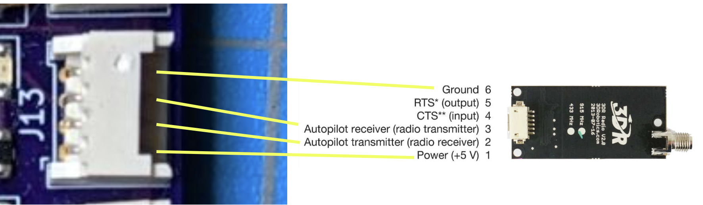
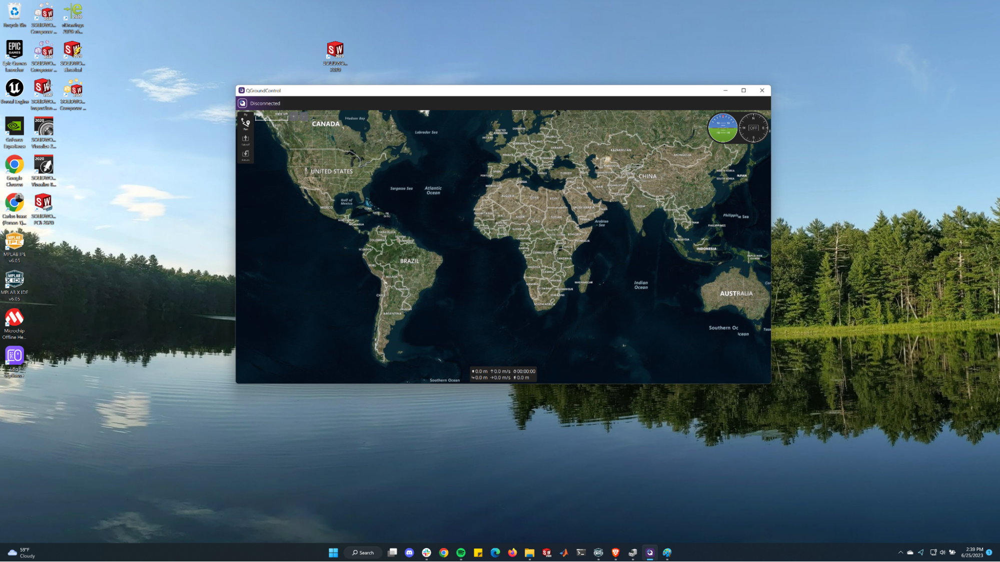

# Test Harness

Navigate to opensource-autonomous-vehicle-controller -> lib

- AS5047D.X contains the test harness of the encoder
  - Encoder can be found [here](https://ams.com/en/as5047d)

- Garmin_LIDAR_V3HP.X
  - LIDAR found [here](https://www.garmin.com/en-US/p/578152)

- ICM-20948 contains the test harness of the IMU
  - IMU found [here](https://www.sparkfun.com/products/15335)

- NEO_M8N.X contains the test harness of the GPS
  - GPS found [here](https://store.mrobotics.io/product-p/gps001-mr.htm)

- Radio_serial.X contains the test harness of the radio telemetry (for Mavlink)
  - Radio telemetry kit found [here](https://www.sparkfun.com/products/retired/17255)

- RC_ESC.X contains the test harness of the DC brushless unidirectional and bidirectional motors
  - DC brushless motor found [here](https://qwinout.com/products/qwinout-30a-rc-brushless-esc-and-a2212-2200kv-brushless-motor-for-diy-aircraft-model-quadcopter-rc-drone-4-sets)

- RC_RX.X contains the test harness of the radio controller
  - Radio receiver found [here](https://www.frsky-rc.com/product/xsr/)
    - Radio transmitter found [here](https://www.frsky-rc.com/product/taranis-x9-lite/)

- RC_servo.X contains the test harness of the servo motors
  - Servo motor found [here](https://www.digikey.com/en/products/detail/terasic-inc/FXX-3037-TOP/7044113)

## Running the Teat Harness

- Note: Before running the test harnesses, make sure that you have properly connected your peripherals
- File -> Open Project -> open-source-autonomous-vehicle-controller -> lib
- Open the folder that contains the desired test harness in MPLAB
- Open the folder’s Project Properties (File -> Project Properties)

- Choose Connected Hardware Tool to PICkit3
- Navigate to xc32-ld -> choose General as the option category -> set the Heap Size (bytes) to be 0 bytes

- Click Clean and Build 

- Click Make and Program Device 
- Open a serial port terminal app (CoolTerm for Mac, PuTTY for Windows) and set the baud rate to 115200

## IMU Test Harness

### Hardware Setup for IMU

for reference to the IMU documentation refer [here](https://learn.sparkfun.com/tutorials/sparkfun-9dof-imu-icm-20948-breakout-hookup-guide)

<!-- ### Software Setup for IMU

- File -> Open Project

- Now navigate to -> open-source-autonomous-vehicle-controller -> lib -> Test_harness.X
you would be able to see the below window with the serial project open

- Now Open Test_harness.X Project Properties (File -> Project Properties)

- Choose Connected Hardware Tool to PICkit3

- Navigate to xc32-ld

- Choose General as the option category

- set the Heap Size (bytes) to be 8000 bytes

- Click OK to save the modified Project Properties

- In the main.c file, set the IMU_test boolean as TRUE

- Click Clean and Build

- Click Make and Program Device

- Open your preset serial terminal application (CoolTerm) -->
Follow the steps given in Running the Teat Harness.

The terminal output should continuously report and update the IMU’s accelerometer, gyroscope, magnetometer readings in the x, y, and z axes, temperature, and magnetometer status. If the magnetometer status is always 0xff08, there might be an issue with your IMU:

## Motor Test Harness

### Hardware Setup for Motor

<!-- ### Software Setup for Motor

- In the main.c file, set the Servo_test boolean as TRUE or the Brushless_test boolean as TRUE depending on if you have a servo or brushless motor.

- Click Clean and Build

- Click Make and Program Device

- Open your preset serial terminal application (CoolTerm) -->

### RC Servo Output

- The terminal output for the RC servo motor should be the current pulse in microseconds and the raw timer ticks.

### DC Brushless Output

- To calibrate a ESC unidirectional motor:
  - Power it up by connecting it to a battery, and you should hear continuous beeping
  - Wait for at least three beeps
  - Connect to the PWM output channels in the OSAVC
  - Open the RC_ESC.X folder and click Make and Program Device
  - Set the minimum ticks of the motor for five seconds. This is automatically taken care of by the RC_ESC test harness.
- The terminal output for the DC brushless motor should be the current pulse in microseconds and the raw timer ticks. PWM output channels 1 and 2 are for unidirectional brushless motors while PWM3 and PWM4 are for bidirectional brushless motors.

## GPS Test Harness

### Hardware Setup for GPS

<!-- ### Software Setup for GPS

- In the main.c file, set the GPS_test boolean as TRUE.

- Click Clean and Build

- Click Make and Program Device

- Open your preset serial terminal application (CoolTerm)

Output should be: -->

### Output

- The terminal output should continuously report and update the time, latitude, longitude, speed, and heading acquired from the GPS module. Please note that the GPS module needs some time to acquire a satellite fix.

## RC Receiver Test Harness

### Hardware Setup for RC Receiver

<!-- ### Software Setup for RC Receiver

- In the main.c file, set the Radio_test boolean as TRUE.

- Click Clean and Build

- Click Make and Program Device

- Open your preset serial terminal application (CoolTerm) -->

### Output for RC Receiver Test Harness

- The terminal output should continuously report and update the user input to the nine channels of the radio transmitter.

## Radio Telemetry Test Harness

### Hardware Setup for Radio Telemetry

### Output for Radio Telemetry

- The terminal output should show a message like this.

- Then, click File -> New to open a new terminal.

- Set the new terminal’s port to be the other usbserial (of the radio module, not the OSAVC serial port) and set the baud rate to be 57600

- Click Connect at the top of the application
- Now, type a message like “Hello world” in the new terminal, and the message should be echoed in your original terminal.

## Encoder Test Harder

### Hardware Setup for Encoder

## LIDAR Test Harder

### Hardware Setup for LIDAR

### Output for LIDAR Test Harness

<!-- ## Mavlink Test Harness

### Hardware Setup for Mavlink

### Software Setup for RC Mavlink

- Open QGroundControl

- In the main.c file, set the Heartbeat_test boolean as TRUE.

- Click Clean and Build

- Click Make and Program Device

- In QGroundControl, make sure that the upper left hand corner says “Armed”

- Click on the Q in the upper left hand corner for the menu to appear

- Click on Analyze Tools -> MAVlink Inspector

- Make sure that you’re receiving a heartbeat -->
