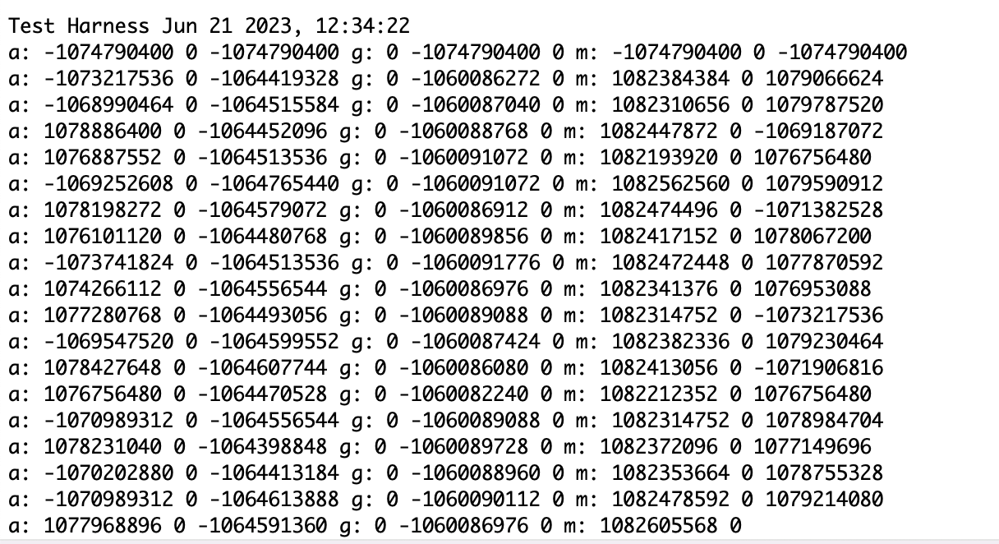

# Test Harness

for reference to the IMU documentation refer [here](https://learn.sparkfun.com/tutorials/sparkfun-9dof-imu-icm-20948-breakout-hookup-guide)

## IMU Test Harness

- File -> Open Project

- Now navigate to -> open-source-autonomous-vehicle-controller -> lib -> Test_harness.X
you would be able to see the below window with the serial project open
<!--  -->

- Now Open Test_harness.X Project Properties (File -> Project Properties)

- Choose Connected Hardware Tool to PICkit3

- Navigate to xc32-ld

- Choose General as the option category

- set the Heap Size (bytes) to be 8000 bytes

- Click OK to save the modified Project Properties

- In the main.c file, set the IMU_test boolean as TRUE

- Click Clean and Build

- Click Make and Program Device

- Open your preset serial terminal application (CoolTerm)

Output should be:

## Motor Test Harness

### Hardware Setup for Motor

### Software Setup for Motor

- In the main.c file, set the Servo_test boolean as TRUE or the Brushless_test boolean as TRUE depending on if you have a servo or brushless motor.

- Click Clean and Build

- Click Make and Program Device

- Open your preset serial terminal application (CoolTerm)

Output should be:

## GPS Test Harness

### Hardware Setup for GPS

### Software Setup for GPS

- In the main.c file, set the GPS_test boolean as TRUE.

- Click Clean and Build

- Click Make and Program Device

- Open your preset serial terminal application (CoolTerm)

Output should be:

## RC Receiver Test Harness

### Hardware Setup for RC Receiver

### Software Setup for RC Receiver

- In the main.c file, set the Radio_test boolean as TRUE.

- Click Clean and Build

- Click Make and Program Device

- Open your preset serial terminal application (CoolTerm)

Output should be:

## Mavlink Test Harness

### Hardware Setup for Mavlink

### Software Setup for RC Mavlink

- Open QGroundControl

- In the main.c file, set the Heartbeat_test boolean as TRUE.

- Click Clean and Build

- Click Make and Program Device

- In QGroundControl, make sure that the upper left hand corner says “Armed”

- Click on the Q in the upper left hand corner for the menu to appear

- Click on Analyze Tools -> MAVlink Inspector

- Make sure that you’re receiving a heartbeat
