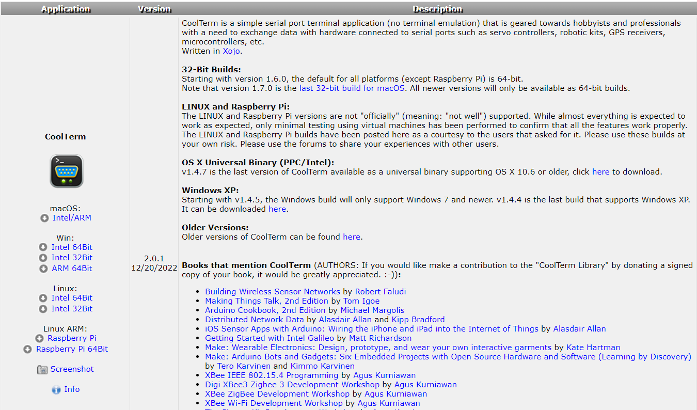

# Installations

## Git & Github Installations

Make sure you have a Github account.

Click [here](https://github.com/), and continue below based on your OS.

### For Windows

- Git Installations : Click [here](https://git-scm.com/downloads)

### For Linux

- Open terminal and run the following commands

```bash
  sudo apt-get update
  ```

  ```bash
  sudo apt-get install git
  ```

### For MacOS

- Open terminal and run the following commands

```bash
brew install git
```

Now follow [this](https://git-scm.com/book/en/v2/GitHub-Account-Setup-and-Configuration#:~:text=The%20first%20thing%20you%20need,Sign%20up%20for%20GitHub%E2%80%9D%20button) to set up git with GitHub.

To check if you have git installed properly type git help in your terminal; make sure that there are no errors and git is recognized as a command

```bash
git help
```

## MPLAB Installation

Download the MPLAB X IDE v6.05 [here](https://www.microchip.com/en-us/tools-resources/develop/mplab-x-ide#tabs) according to your system.


Ensure that the version number is v6.05

## XC32 Compiler Installation

Download the XC32 Compiler v4.21 [here](https://www.microchip.com/en-us/tools-resources/develop/mplab-xc-compilers/downloads-documentation#XC32) according to your system.


Ensure that the version number is v4.21

## Serial Terminal Installation

Install CoolTerm available [here](http://freeware.the-meiers.org/)


