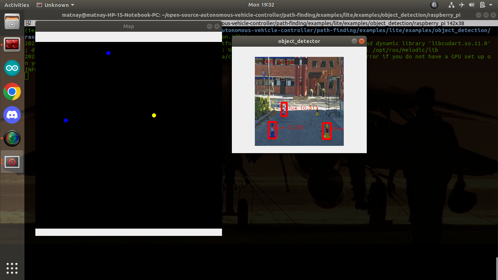

## <div align="center">Path Finding</div>
<p align="center">
  
</p>
Detection of the course markers to help an autonomous vehicle find an optimal trajectory to complete the circuit. For detection of course markers(coloured cones), ML(object detection) and CV algorithms are used. Inference on embedded devices can be performed using the optimized TFlite models and accelerated using the Google Coral Edge TPU.<br><br>

[Try it in Google Colaboratory](data/Notebook/OSAVC_Path_Finding.ipynb)<br><br>

#### Directory Structure
```
path-finding
│   README.md    
│
└───data
│   │   README.md  
│   └───annotations
|   └───demo
|   └───images
|   └───Notebook
|
└───models
|   |   README.md
│   └───EfficientDet0
│   └───EfficientDet0-Lite
│   └───ssd-models
│   └───yolov5
│   └───yolov5-coral
│   └───yolov5-rpi
|      
└───scripts
|    |   README.md
|    └───install
|    └───legacy_scripts
|    └───training
|
└───cone_mapper
      README.md
```
### data
Contains links to our pre-split dataset, the Jupyter Notebooks to train your own model with this data or your custom dataset and image annotations 

### models
A collection of pre-trained models, including EfficientDet0, EfficientDet-Lite0, ssd_mobilenet_v2, yolov5, yolov5-coral and yolov5-rpi. Detailed instructions on how to use them can be found in their respective directories.

### scripts
Contains scripts required for training your own models, setting up your environment, installation of dependencies and performing inference with trained models

## Installation and Inference
Choose the model you want to run from [models](models) and follow the instructions in the README of the respective model. The recommended model is EfficientDet0-Lite which can be run on a Raspberry Pi and optionally accelerated using a Coral Edge TPU following the [instructions given here](models/EfficientDet0-Lite/). 

## cone_mapper
<p align="center">
  
</p>
A package that uses camera intrinsics and exploits known geometry of the landmarks to predict their 3D locations. Instructions to run this with [EfficientDet0-Lite](models/EfficientDet0-Lite/) can be found in the ```README.md``` in ```cone_mapper```.
