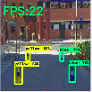

## <div align="center">Path Finding</div>
<br>
Detection of the course markers to help an autonomous vehicle find an optimal trajectory to complete the circuit. For detection of course markers(coloured cones), ML(object detection) and CV algorithms are used. Inference on embedded devices can be performed using the optimized TFlite models and accelerated using the Google Coral Edge TPU.<br><br>

<br>

### data
Contains links to our pre-split dataset, the Jupyter Notebooks to train your own model with this data or your custom dataset and image annotations 

### models
A collection of pre-trained models, including EfficientDet0, EfficientDet-Lite0, ssd_mobilenet_v2, yolov5, yolov5-coral and yolov5-rpi. Detailed instructions on how to use them can be found in their respective directories.

### scripts
Contains scripts required for training your own models, setting up your environment, installation of dependencies and performing inference with trained models

## Installation and inference on the Raspberry Pi
Run the following from the root of the cloned repository. Give permission and execute the environment setup and installation scripts 
```
cd <PATH_TO_REPO>/open-source-autonomous-vehicle-controller/path-finding
chmod u+x scripts/install/env.sh scripts/install/install.sh
source scripts/install/env.sh
source scripts/install/install.sh
```
Perform Inference on Raspberry Pi with Coral Edge TPU disabled:<br>
Video Stream from Camera
```
python3 detect.py --model cone_detection.tflite 
```
Using recorded demo video
```
python3 cone_detect.py --model cone_detection.tflite 
```
Perform Inference on Raspberry Pi with Coral Edge TPU enabled:<br>
Video Stream from Camera
```
python3 detect.py --model cone_detection.tflite --enableEdgeTPU
```
Using recorded demo video
```
python3 cone_detect.py --model cone_detection.tflite --enableEdgeTPU
```

